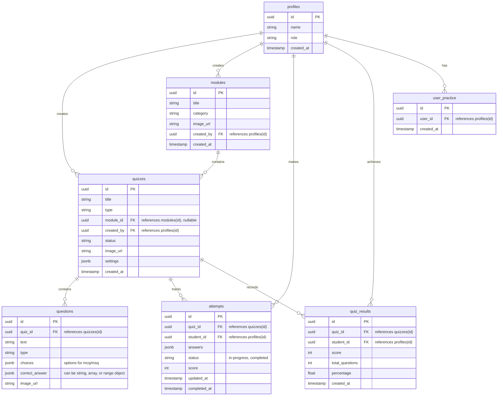

# Database Connections Diagram

This diagram represents the database schema and relationships based on the Supabase queries used in the frontend application.

### Relationship Breakdown:
- **`profiles`** acts as the central User table (acting as Students, Faculty, or Admins).
- **`modules`** are top-level containers for courses or subject areas, created by Faculty/Admins.
- **`quizzes`** can either belong to a specific `module` (via `module_id`) or be standalone (e.g. Master tests). They contain many `questions`.
- **`questions`** are the individual test items belonging to a particular `quiz`.
- **`attempts`** track a student's ongoing or completed test attempt, storing the draft `answers`. It connects a `profile` (student) to a `quiz`.
- **`quiz_results`** store the final grade and percentage of a completed test.
- **`user_practice`** tracks specific practice sessions or module unlocks for a `profile`.
